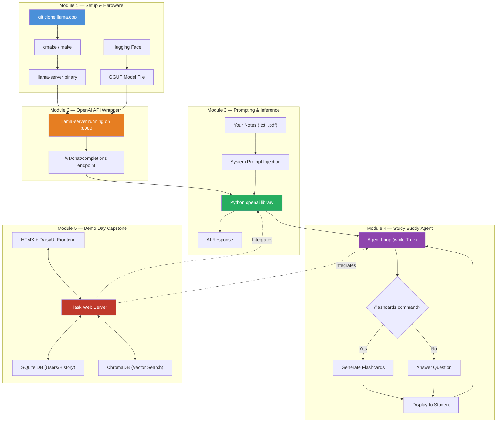
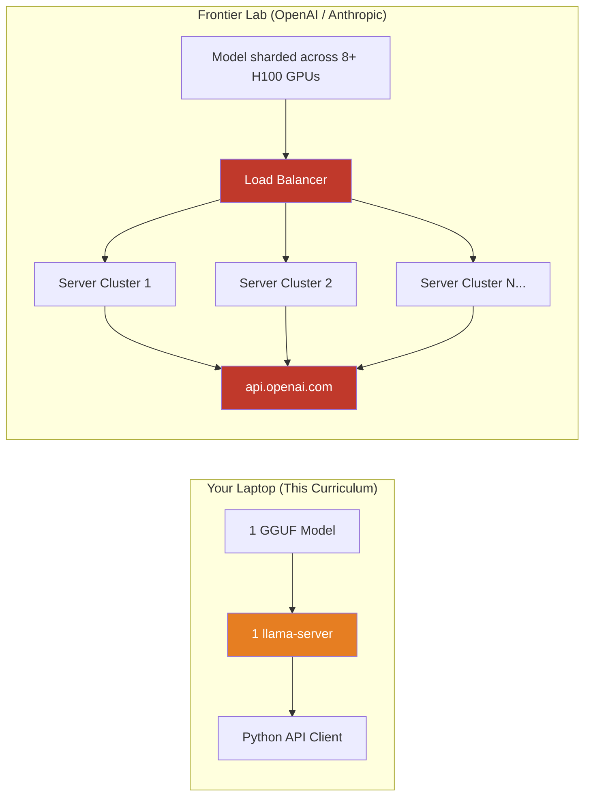

# Architecture Diagram

This diagram shows how all five modules connect to form a complete local AI pipeline.

```mermaid
graph TB
    subgraph "Module 1 — Setup & Hardware"
        A["git clone llama.cpp"] --> B["cmake / make"]
        B --> C["llama-server binary"]
        D["Hugging Face"] --> E["GGUF Model File"]
    end

    subgraph "Module 2 — OpenAI API Wrapper"
        C --> F["llama-server running on :8080"]
        E --> F
        F --> G["/v1/chat/completions endpoint"]
    end

    subgraph "Module 3 — Prompting & Inference"
        G --> H["Python openai library"]
        I["Your Notes (.txt, .pdf)"] --> J["System Prompt Injection"]
        J --> H
        H --> K["AI Response"]
    end

    subgraph "Module 4 — Study Buddy Agent"
        H --> L["Agent Loop (while True)"]
        L --> M{"/flashcards command?"}
        M -->|Yes| N["Generate Flashcards"]
        M -->|No| O["Answer Question"]
        N --> P["Display to Student"]
        O --> P
        P --> L
    end

    subgraph "Module 5 — Demo Day Capstone"
        Q["Flask Web Server"]
        R["SQLite DB (Users/History)"]
        S["ChromaDB (Vector Search)"]
        T["HTMX + DaisyUI Frontend"]
        
        T <--> Q
        Q <--> R
        Q <--> S
    end

    %% Cross-Module Integrations
    L ~~~ Q
    Q -.->|Integrates| H
    Q -.->|Integrates| L

    style A fill:#4a90d9,color:#fff
    style F fill:#e67e22,color:#fff
    style H fill:#27ae60,color:#fff
    style L fill:#8e44ad,color:#fff
    style Q fill:#c0392b,color:#fff
```

## How It Maps to Frontier Labs

```mermaid
graph LR
    subgraph "Your Laptop (This Curriculum)"
        YM["1 GGUF Model"] --> YS["1 llama-server"]
        YS --> YA["Python API Client"]
    end

    subgraph "Frontier Lab (OpenAI / Anthropic)"
        FM["Model sharded across 8+ H100 GPUs"] --> FB["Load Balancer"]
        FB --> FS1["Server Cluster 1"]
        FB --> FS2["Server Cluster 2"]
        FB --> FS3["Server Cluster N..."]
        FS1 --> FA["api.openai.com"]
        FS2 --> FA
        FS3 --> FA
    end

    style YS fill:#e67e22,color:#fff
    style FB fill:#c0392b,color:#fff
    style FA fill:#c0392b,color:#fff
```
