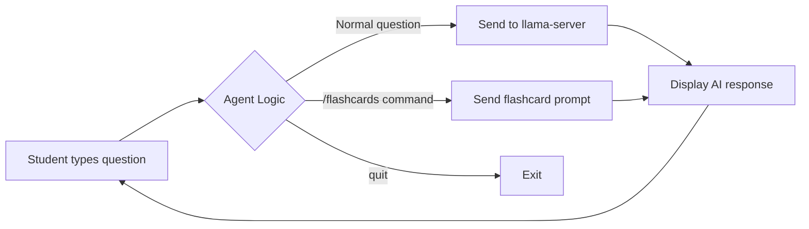

# Module 4: Practical Application 🚀

> **Goal:** Combine everything you've learned to build a **Local AI Study Buddy Agent** — a command-line AI tutor that reads your notes, answers questions, and generates flashcards.

---

## 🧠 The Frontier Lab Connection

At this point, you've built the same pipeline that powers every AI product:

1. **Engine** (Module 1) → You compiled a C++ inference server
2. **API** (Module 2) → You served it over HTTP with OpenAI compatibility
3. **Intelligence** (Module 3) → You injected data and engineered prompts

Now we add the final layer: an **Agent**. An agent is just a program that uses an AI model in a **loop**, making decisions and taking actions based on user input. ChatGPT's "Code Interpreter," Google's AI assistants, and Anthropic's Claude with tool use — they're all agents. And you're about to build one.



---

## The Mission

Build a Python script that:

| # | Feature | Description |
|---|---------|-------------|
| 1 | **Connects** to `llama-server` | Uses the OpenAI library pointed at `localhost:8080` |
| 2 | **Reads notes** from a file | Loads `.txt` files and injects them into the system prompt |
| 3 | **Runs in a loop** | Continuously accepts questions until the user types `quit` |
| 4 | **Remembers context** | Maintains conversation history so follow-up questions work |
| 5 | **Has slash commands** | `/flashcards` generates study flashcards from the notes |

---

## The Code

The complete solution is in [`code/study_buddy_agent.py`](./code/study_buddy_agent.py). Let's walk through the key concepts:

### 1. The System Prompt (The Agent's Brain)

```python
system_instructions = f"""You are a helpful high school study assistant. 
Use the following notes to help the student learn. Do not make up facts 
outside these notes.
NOTES: {notes_content}"""
```

This is where you define the agent's **personality and constraints**. At frontier labs, this is called the "system prompt" or "meta prompt" — and companies spend weeks tuning these.

### 2. The Conversation History (Simulating Memory)

```python
conversation_history = [
    {"role": "system", "content": system_instructions}
]
```

Remember: LLMs are **stateless**. To create the illusion of memory, we keep a Python list of every message and send the **entire list** back with each request. This is exactly how ChatGPT works.

### 3. The Agent Loop

```python
while True:
    user_input = input("\nYou: ")
    
    if user_input.lower() == '/flashcards':
        prompt = "Generate 3 Q&A flashcards based ONLY on the notes."
    else:
        prompt = user_input
    
    conversation_history.append({"role": "user", "content": prompt})
    response = client.chat.completions.create(...)
    conversation_history.append({"role": "assistant", "content": ai_response})
```

This is the **agent pattern**: a `while True` loop that intercepts user input, applies logic (like detecting `/flashcards`), and routes it to the AI. Every AI agent in production — from customer service bots to coding assistants — uses this same pattern.

---

## Running the Study Buddy

### 1. Make sure `llama-server` is running

```bash
# In terminal 1 (keep this open)
./llama-server -m models/llama-3.2-3b.gguf --port 8080
```

### 2. Run the agent

```bash
# In terminal 2
cd modules/04-practical-application/code
pip install openai
python study_buddy_agent.py
```

### 3. Try these interactions

```
You: What was the Industrial Revolution?
Study Buddy: Based on the notes, the Industrial Revolution began in Great 
             Britain in the late 18th century...

You: What fuel did they use?
Study Buddy: According to the notes, coal became the primary fuel source.

You: /flashcards
Study Buddy: 
  📝 Flashcard 1
  Q: Where did the Industrial Revolution begin?
  A: Great Britain, in the late 18th century.
  
  📝 Flashcard 2
  Q: What shift did the Industrial Revolution represent?
  A: A shift from hand-production methods to machines.
  
  📝 Flashcard 3
  Q: What became the primary fuel source?
  A: Coal.

You: quit
🤖 Good luck on your test!
```

---

## 🏆 Challenges for Students

Now that you have a working agent, try extending it:

### Challenge 1: Save Flashcards to a File
Modify the agent so that when `/flashcards` is used, the generated flashcards are also saved to a `flashcards.txt` file.

<details>
<summary>💡 Hint</summary>

```python
if user_input.lower() == '/flashcards':
    # ... after getting the response ...
    with open("flashcards.txt", "a") as f:
        f.write(ai_response + "\n\n")
    print("💾 Flashcards saved to flashcards.txt!")
```
</details>

### Challenge 2: Read Multiple Note Files
Instead of reading one file, make the agent read **all `.txt` files** from a `notes/` folder.

<details>
<summary>💡 Hint</summary>

```python
import glob

def load_all_notes():
    all_notes = ""
    for filepath in glob.glob("notes/*.txt"):
        with open(filepath, "r") as f:
            all_notes += f"\n--- {filepath} ---\n{f.read()}"
    return all_notes
```
</details>

### Challenge 3: Add a `/summary` Command
Add a new slash command `/summary` that asks the AI to summarize all the notes in 3 bullet points.

### Challenge 4: Give It a Persona
Change the system prompt to make the AI respond as:
- A cranky 18th-century professor
- A surfer dude who happens to know biology
- A detective solving the "mystery" of your study topic

### Challenge 5: Add a `/quiz` Command
Create a `/quiz` command that generates a multiple-choice question and checks the student's answer.

---

## 🔬 How This Maps to Real Products

| Your Study Buddy | Real-World AI Product |
|-------------------|----------------------|
| `system_instructions` | ChatGPT's hidden system prompt |
| `conversation_history` list | ChatGPT's conversation memory |
| `/flashcards` command | ChatGPT's "Code Interpreter" tool use |
| Reading `.txt` files | RAG systems reading databases |
| `while True` loop | Production agent event loops |
| `temperature=0.3` | Per-use-case tuning at frontier labs |

---

## ✅ Module 4 Checkpoint (Final!)

Congratulations! Verify you can:

- [ ] Run `study_buddy_agent.py` and have a conversation with context
- [ ] Use `/flashcards` to generate study cards from notes
- [ ] Explain what an "agent" is (an AI in a loop with logic and tools)
- [ ] Describe how `llama-server` is a micro-version of what OpenAI runs

---

## 🎓 What's Next?

You've built a real AI pipeline from scratch. Here are paths to go deeper:

| Direction | What to Learn |
|-----------|---------------|
| **RAG at scale** | Add a vector database (ChromaDB) to handle hundreds of pages |
| **Fine-tuning** | Train the model on your own data using LoRA adapters |
| **Web UI** | Build a React or Flask frontend instead of the command line |
| **Multi-agent** | Have two AI agents debate each other about your study material |
| **Tool use** | Give the AI the ability to search Wikipedia or run Python code |

---

**⬅️ Previous: [Module 3 — Prompting & Inference](../03-prompting-and-inference/)** | **➡️ Next: [Module 5 — Demo Day](../05-demo-day/)** | **🏠 [Back to Home](../../README.md)**
