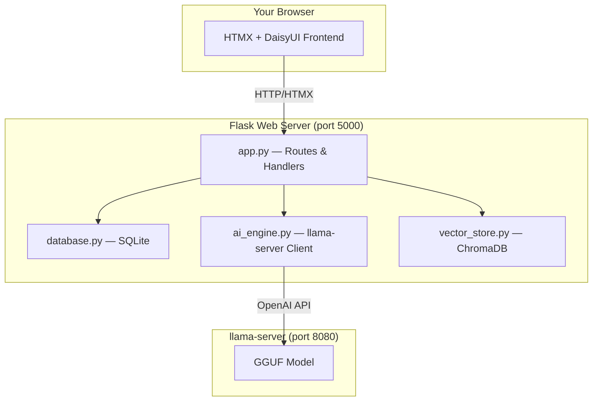

# Module 5: Demo Day — Build Your Own Frontier Lab 🎓

> **Goal:** Combine everything from Modules 1–4 into a full-stack web application — a real product you can demo, share, and be proud of. This is your capstone project.

---

## 🧠 The Frontier Lab Connection

In Modules 1–4, you built the **engine**. Now you're building the **entire company**:

| What You Built Before | What You're Building Now |
|---|---|
| llama-server binary | A complete web product |
| Python API client | A Flask web server with routes, auth, and databases |
| Prompt engineering | An AI pipeline: classify → extract → search |
| CLI Study Buddy | A beautiful UI with HTMX and DaisyUI |

This is exactly how AI startups work:
1. They start with a model (like you compiled in Module 1)
2. They wrap it in an API (Module 2)
3. They engineer prompts and build RAG pipelines (Module 3)
4. They build agents (Module 4)
5. **They ship a product** (this module!)

> [!NOTE]
> **This module has no time limit.** Unlike Modules 1–4 (which fit in a class period), Demo Day is a multi-session project. Work at your own pace, customize the features, and make it yours.

---

## What You're Building

**Study Llama** — A web application where users can:

1. 📂 **Create categories** for their notes (Biology, History, Math, etc.)
2. 📤 **Upload notes** (.txt files) — the AI automatically classifies them and extracts summaries + FAQs
3. 🔍 **Search across all notes** using natural language queries powered by vector similarity

### The Tech Stack

| Layer | Technology | What It Does |
|-------|-----------|-------------|
| **AI Engine** | Your `llama-server` from Module 1 | Classification, extraction, embeddings |
| **API Client** | Python `openai` library | Talks to llama-server (same as Module 2) |
| **Web Framework** | Flask (Python) | Handles HTTP requests and serves pages |
| **Templates** | Jinja2 + HTMX + DaisyUI | Beautiful, dynamic UI without writing JavaScript |
| **Database** | SQLite | Stores users, categories, and note metadata |
| **Vector Store** | ChromaDB | Semantic search across note content |

> [!IMPORTANT]
> **Everything runs locally.** No cloud accounts. No API keys. No monthly bills. This is a real product running on your hardware.

---

## Architecture



---

## Phase 1: Setup (30 minutes)

### Prerequisites
- Modules 1–4 completed
- `llama-server` compiled and a GGUF model downloaded
- Python 3.10+ with `pip`

### Install Dependencies

```bash
cd modules/05-demo-day/code
pip install -r requirements.txt
```

This installs:
- **Flask** — Web framework (like Express.js for Python)
- **ChromaDB** — Local vector database
- **openai** — API client (same one from Module 2)
- **werkzeug** — Password hashing utilities

### Start llama-server

In a **separate terminal**, start your model:

```bash
# Mac/Linux
./llama-server -m models/llama-3.2-3b.gguf --port 8080

# Windows
.\build\bin\Release\llama-server.exe -m models\llama-3.2-3b.gguf --port 8080
```

### Start the Web App

```bash
cd modules/05-demo-day/code
python app.py
```

Open **http://localhost:5000** in your browser. You should see the Study Llama landing page! 🦙

---

## Phase 2: Walkthrough — How the Code Works

### 📁 File Guide

| File | Lines | What It Does | Frontier Lab Equivalent |
|------|-------|-------------|-------------------------|
| `config.py` | ~35 | Central configuration | Environment variables |
| `database.py` | ~150 | SQLite user, category, and note storage | PostgreSQL/DynamoDB cluster |
| `ai_engine.py` | ~175 | llama-server classify, extract, embed | LlamaCloud / OpenAI API |
| `vector_store.py` | ~180 | ChromaDB semantic search | Qdrant / Pinecone cluster |
| `app.py` | ~250 | Flask routes & handlers | Go/Node.js API servers |

### The Upload Pipeline

When a user uploads a note, here's what happens (see `upload_note()` in `app.py`):

```
1. User uploads biology_notes.txt
       ↓
2. Flask saves the file to disk
       ↓
3. ai_engine.classify_note() → Sends text to llama-server
   "Given these categories: [Biology, History], classify this text..."
   → Returns: "Biology"
       ↓
4. ai_engine.extract_study_notes() → Sends text to llama-server
   "Extract a summary and 3-5 FAQs from this document..."
   → Returns: {"summary": "...", "faqs": [{q, a}, ...]}
       ↓
5. vector_store.store_summary() → Saves summary embedding in ChromaDB
   vector_store.store_faqs()   → Saves FAQ embeddings in ChromaDB
       ↓
6. database.create_note() → Saves metadata in SQLite
       ↓
7. HTMX updates the notes table — no page reload!
```

---

## Phase 3: Customization Challenges

This is where you make it **yours**. Pick at least 2 challenges:

### 🥉 Bronze Challenges
- **Custom theme** — Change the DaisyUI theme from `dark` to `cupcake`, `synthwave`, or `cyberpunk` (edit `base.html`)
- **Add a `/flashcards` page** — Reuse the flashcard generation from Module 4 but with a web UI
- **File format support** — Extend the upload to support `.md` (Markdown) and `.csv` files

### 🥈 Silver Challenges
- **Conversation mode** — Add a chat page where students can ask follow-up questions (use the `chat_with_notes()` function in `ai_engine.py`)
- **Export flashcards** — Add a button that downloads generated FAQs as a `.txt` or `.csv` file
- **Note preview** — Show the full note content when clicking on a note in the table

### 🥇 Gold Challenges
- **PDF support** — Add `PyPDF2` to extract text from PDF uploads
- **Multi-user demo** — Deploy to a second computer on the network using `--host 0.0.0.0`
- **Study quiz mode** — Create an interactive quiz that scores student answers using AI

### 💎 Diamond Challenge: The Pitch
- **Demo Day Presentation** — Create a 5-minute pitch for your Study Llama as if presenting to investors:
  1. **The Problem** — "Students spend hours organizing notes..."
  2. **The Solution** — Live demo of your app
  3. **The Tech** — Explain the architecture diagram
  4. **The Business** — How would you monetize this? What's the market?
  5. **The Moat** — Why is "local-first AI" a competitive advantage?

---

## Phase 4: Entrepreneurship Skills

### 💰 Pricing Exercise

OpenAI charges per token. Calculate what it would cost to run Study Llama on their API instead:

| Operation | Estimated Tokens | OpenAI Price (GPT-4o mini) |
|-----------|-----------------|---------------------------|
| Classify 1 note | ~500 tokens | ~$0.0001 |
| Extract summary + FAQs | ~2,000 tokens | ~$0.0004 |
| 100 notes/day × 30 days | ~7.5M tokens/month | ~$1.50/month |

**Your cost with llama-server?** $0.00 (just electricity).

> This is why "local AI" is a real business strategy. Companies like [Ollama](https://ollama.com), [LM Studio](https://lmstudio.ai), and [Jan](https://jan.ai) are building businesses around this exact idea.

### 👥 User Research Exercise

Interview 3 classmates:
1. How do you currently organize your study notes?
2. Would you use an AI that auto-categorizes and quizzes you?
3. What features would make you switch from your current method?

---

## 🔬 How This Maps to a Real Startup

| Your Project | Real Startup |
|---|---|
| `app.py` (Flask) | Production API (FastAPI + Gunicorn + Nginx) |
| SQLite (`study_buddy.db`) | Managed PostgreSQL (AWS RDS, Supabase) |
| ChromaDB (local files) | Managed vector DB (Pinecone, Qdrant Cloud) |
| llama-server (1 model) | GPU cluster (8x H100s, vLLM, load balancers) |
| `python app.py` | Docker + Kubernetes + CI/CD pipelines |
| 1 user (you) | Millions of concurrent users |

The **architecture is identical**. The **scale is different**. That's the entire lesson of OpenFrontier.

---

## ✅ Module 5 Checkpoint (Final!)

- [ ] Study Llama web app runs at `http://localhost:5000`
- [ ] You can create an account and log in
- [ ] You can create at least 2 categories
- [ ] You can upload a note and see it auto-classified
- [ ] Search returns relevant results from your notes
- [ ] You completed at least 2 customization challenges
- [ ] You can explain the full architecture: Browser → Flask → llama-server → ChromaDB

---

## 🎉 Congratulations!

You've built a complete AI product from scratch:
- Compiled a C++ inference engine
- Hosted an OpenAI-compatible API
- Engineered prompts and built RAG pipelines
- Created an AI agent
- Shipped a full-stack web application

**You now understand how frontier AI labs work — because you built one.**

---

**⬅️ Previous: [Module 4 — Practical Application](../04-practical-application/)** | **🏠 [Back to Home](../../README.md)**
